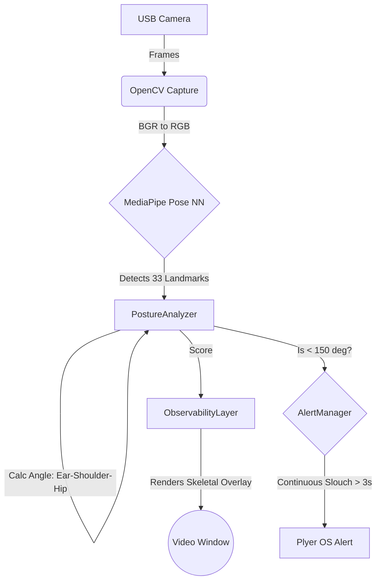

# AutoPosture: Real-time Neural Network Posture Monitoring

AutoPosture is an educational hobby project designed to help you learn about computer vision, real-time video processing, and neural network pose estimation while actively improving your posture!

## How It Works

AutoPosture uses a standard USB camera continuously fed into an **Observability Layer** built with OpenCV. Behind the scenes, the **Google MediaPipe Pose** neural network processes each frame to detect 33 3D body landmarks.

By applying geometric math to the coordinates of your **Ear, Shoulder, and Hip**, the application calculates an angle that determines how upright you are sitting. If your posture angle drops below a certain threshold for a continuous period, it triggers your computer's native desktop notification system so you know to sit up straight!

### Architecture Flow

## Setup & Running

This project uses `uv` for lightning-fast dependency and environment management. All dependencies are already generated in `pyproject.toml`.

1. Ensure your USB camera is plugged in.
2. In your terminal, run `uv run main.py` to start the application.
3. The **Observability Layer** window will open, showing you the neural network's perception of your skeletal structure.
4. Try slouching for more than 3 seconds—you should see the skeletal lines turn red and receive a desktop notification!
5. Press `q` while focused on the video window to quit.

## Concepts Learned

- **OpenCV (`cv2`)**: Used for interfacing with the hardware camera and drawing graphics directly onto pixel arrays.
- **MediaPipe Pose (`mp.solutions.pose`)**: A blazing-fast machine learning model optimized to run on the CPU. It doesn't require a dedicated GPU.
- **Euclidean Vectors**: We use the dot product formula (`cos(θ) = (a · b) / (|a| |b|)`) with NumPy to calculate the angle between your joints based on their 2D image coordinates!
